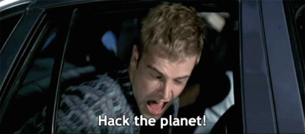

Offensive code and pasta 🍝.

👾 Visit my blog: https://pwnyour.site

<b># whoami</b>

  
I work primarily as a SOC Analyst and Akamai technician, with additional experience on pentests and managing customer vulnerabilities on Tenable.

Besides english, my brain currently supports the following languages: 
- *Italiano*
- *Español*
- *Portugûes*

## Repos

My mind is constantly thinking about new projects. Here's just the 10% of them.

> 
> 
> 
> 

## Contributions

Honored to contribute to some cool projects:
- [Holehe](https://github.com/megadose/holehe) 😈 
- [Gobuster](https://github.com/OJ/gobuster) 👻

